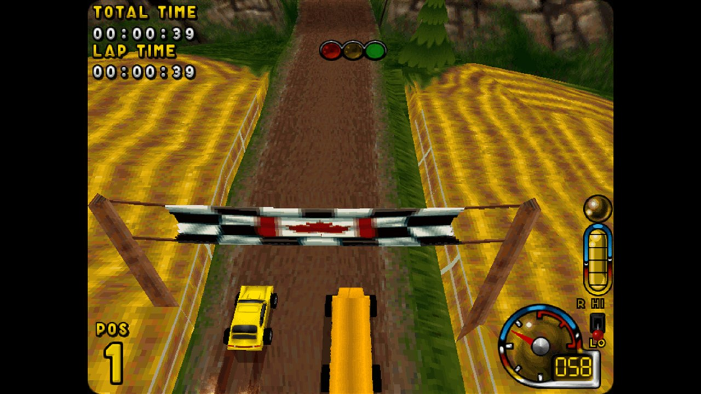

# ignition-compat

A drop-in `ddraw.dll` that reimplements DirectDraw on **Direct3D 11**, so
**Ignition** (UDS / Virgin Interactive, 1997) runs on **64-bit Windows 11**.

No DOSBox. No virtual machine. No compatibility mode. No crack — the game
executable is never modified.



## Install

Copy two files next to `Ign_win.exe`:

```
ddraw.dll
ign_compat.ini
```

That's it. Windows searches a program's own folder before `System32`, and
`ddraw` is not a KnownDLL, so ours loads instead. To uninstall, delete them.

> This repository contains **no game data**. You need your own copy of Ignition.

## What it fixes

| Problem | Cause | Fix |
|---|---|---|
| Black screen | 8-bit palettised exclusive-fullscreen DirectDraw | never change the display mode; scale on the GPU |
| Silent exit at startup | game calls `GetDC` on a surface | implemented over a DIB section |
| Grey / quarter-width image | engine writes 8-bit indices into a 32bpp stride | allocate by mode bpp, interpret as P8 |
| Crash entering a race | `joyGetDevCapsA`/`joyGetPosEx` AV inside `winmmbase.dll` | IAT hook reporting no joystick |
| 100% CPU on one core | main loop spins; `Sleep` is never imported | `PeekMessageA` hook yields when idle |
| Fullscreen stuck at 640×480 | Windows `640X480` AppCompat shim | remove that shim (see `docs/INSTALL.txt`) |

## Configuration — `ign_compat.ini`

```ini
[ignition]
WINDOWED=0        ; 0 = borderless fullscreen, 1 = window
WINDOW_SCALE=2    ; multiplier when WINDOWED=1
SCALING=aspect    ; aspect | integer | stretch
FILTER=sharp      ; sharp | point | linear
VSYNC=1
PIXEL_FORMAT=auto ; auto is correct; p8 | rgb565 | xrgb888 to override
BLOCK_JOYSTICK=1  ; required - the legacy joystick API crashes on Win10/11
BLOCK_MCI=1       ; disables CD redbook music (optional anyway)
CPU_FIX=1         ; stop the main loop pinning a core
TRACE=0           ; 1 = log every DirectDraw call (slow)
```

`FILTER=sharp` is sharp-bilinear: nearest-neighbour crispness without the
uneven pixel widths a non-integer upscale produces (640 → 1440 is 2.25×).

## How it works

Ignition has **no Direct3D**. No `d3d8`, `d3d9`, `d3dim`, `d3drm`, no Glide.
It is a hand-written x86 software rasterizer that draws every pixel on the CPU
and uses DirectDraw only to get the finished image on screen. That last step is
the only part modern Windows broke, so that is the only part this replaces.

The frame stays 8-bit all the way to the GPU:

* the framebuffer uploads as an `R8_UNORM` texture (one byte per pixel)
* the 256-colour palette is a separate 256×1 `B8G8R8A8` texture
* a pixel shader does the lookup

which means a palette fade — how this engine does most of its transitions —
costs a 1 KB upload instead of reconverting the screen.

`SetDisplayMode` is accepted and ignored: the desktop stays at native
resolution and the GPU scales the output.

### About x64

`Ign_win.exe` is 32-bit and runs under WOW64 — native x86 instructions on your
CPU, not emulation. The shim is therefore 32-bit too, because it loads *into*
the game's process. It talks to the same D3D11 and GPU driver as everything
else on a 64-bit system.

## Build

Needs a 32-bit MinGW-w64 cross compiler:

```sh
# Debian/Ubuntu
sudo apt install gcc-mingw-w64-i686
# Arch
sudo pacman -S mingw-w64-gcc

./ign_compat/build.sh          # -> ign_compat/build/{ddraw,dplayx}.dll
```

## Layout

```
ign_compat/src/common/    D3D11 presenter, IAT hooking, logging
ign_compat/src/ddraw/     the shim - all 4 DirectDraw interfaces
ign_compat/src/dplayx/    2-export stub for machines lacking DirectPlay
ign_compat/src/winmm/     NOT BUILT - a documented dead end, see the header
_re/tools/                capstone-based analysis scripts
_re/notes/                ~3,000 lines of reverse-engineering notes
```

The analysis tooling needs Python 3 with `capstone` and `pefile`:

```sh
python3 -m venv .venv && ./.venv/bin/pip install capstone pefile
./.venv/bin/python _re/tools/scan_api.py Ign_win.exe
```

No Ghidra or radare2 was used. `scan_api.py` recovers the COM surface by
scanning every `call [reg+disp]`, grouping sites by the global that held the
interface pointer, and matching each slot set against the published DirectX
vtable layouts.

## On copy protection

There isn't any. Ignition ships with no disc check — it imports no
disc-probing APIs (`GetDriveTypeA`, `GetLogicalDrives`,
`GetVolumeInformationA`, `DeviceIoControl` are all absent), and the
`"PLEASE INSERT THE IGNITION CD"` string is unreachable dead code. Nothing is
bypassed here because there is nothing to bypass. The only thing a disc
provided was redbook music.

`Ign_win.exe` is untouched: MD5 `527bc475783319ecdd8adae1f97f6759`.

## Status

Working: boots, races, sound, keyboard, windowed and borderless fullscreen,
stable frame pacing, ~20% of one core.

Not done: the software rasterizer itself is still the original 1997 assembly,
so the internal rendering resolution is still capped at what the game offers.
See `docs/ROADMAP.md`.

## Licence

MIT — see `LICENSE`. Applies to this compatibility layer only. Ignition itself
remains the property of its rights holders.

Write-up: [x128.dev](https://x128.dev)
